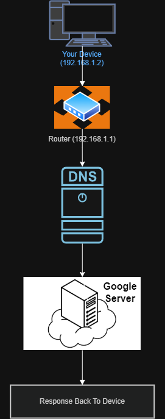

# Networking Task 02

## Objective

The purpose of this task is to understand common network devices, IP addressing concepts, and how data travels within a network.

---

# System Information

| Item              | Value                       |
| ----------------- | --------------------------- |
| IPv4 Address      | 192.168.1.2                 |
| Default Gateway   | 192.168.1.1                 |
| DNS Server        | 192.168.1.1                 |
| Network Interface | eth0                        |
| Environment       | Kali Linux VM on VirtualBox |

---

# Part A: Network Devices Research

## Router

**Purpose:** Connects different networks and provides internet access.

**How it works:** Uses routing tables to forward packets between networks.

**Real-world usage:** Home WiFi routers connect devices to the internet.

---

## Switch

**Purpose:** Connects multiple devices inside a local network.

**How it works:** Uses MAC addresses to send traffic to the correct device.

**Real-world usage:** Used in offices and schools to connect computers.

---

## Hub

**Purpose:** Connects devices inside a network.

**How it works:** Sends incoming traffic to every connected device.

**Real-world usage:** Older network environments.

---

## Access Point

**Purpose:** Provides wireless network connectivity.

**How it works:** Converts wired connections into wireless signals.

**Real-world usage:** Home and office WiFi networks.

---

## Firewall

**Purpose:** Protects systems from unauthorized access.

**How it works:** Filters traffic using predefined rules.

**Real-world usage:** Used in enterprise networks and routers.

---

## Modem

**Purpose:** Connects users to ISP networks.

**How it works:** Converts ISP signals into usable network signals.

**Real-world usage:** Broadband and fiber internet connections.

---

# Part B: IP Address Classification

| IP Address    | Category | Reason                       |
| ------------- | -------- | ---------------------------- |
| 192.168.1.10  | Private  | Reserved private range       |
| 10.0.0.5      | Private  | Falls under 10.0.0.0/8       |
| 172.16.5.20   | Private  | Falls within private range   |
| 8.8.8.8       | Public   | Public internet address      |
| 1.1.1.1       | Public   | Globally reachable           |
| 192.168.100.1 | Private  | Reserved local network range |

---

# Part C: Understanding My Network

### IPv4 Address

192.168.1.2

### Default Gateway

192.168.1.1

### DNS Server

192.168.1.1

### Which IP range does your device belong to?

My system belongs to the 192.168.1.0/24 network range.

### Is it Public or Private?

It is a private IP address.

### What role does your router play?

The router forwards traffic between my local network and the internet.

### What happens if DNS stops working?

Websites would stop resolving domain names into IP addresses, preventing access through names like google.com.

---

# Part D: Network Communication Flow



Communication Flow:

```text
Your Device (192.168.1.2)
        ↓
Router (192.168.1.1)
        ↓
DNS Server
        ↓
Google Server
        ↓
Response Back To Device
```

### Step-by-Step Explanation

**Your Device → Router**

The browser sends a request for google.com through the local router.

**Router → DNS Server**

The router forwards the DNS query to resolve google.com into an IP address.

**DNS Server → Google Server**

After resolving the address, traffic is sent to Google's servers.

**Response Back To Device**

Google returns the requested webpage back through the same route.

---

# Part E: Practical Command Exercise

## Commands Used

```bash
ip addr
nslookup google.com
ping -c 4 google.com
```

## DNS Lookup Result

IPv4 Returned:

142.250.77.110

IPv6 Returned:

2404:6800:4007:808::200e

## Ping Result

* 4 packets transmitted
* 4 packets received
* 0% packet loss
* Average latency: 149.118 ms

### Was Ping Successful?

Yes, all packets were successfully received.

### Why is DNS important before communication begins?

DNS converts domain names into IP addresses so systems know where to send requests.

---

# Screenshots Included

```text
screenshots/

├── ip_addr.png
├── gateway.png
├── dns.png
├── nslookup_google.png
├── ping_google.png
├── network_flow_diagram.png
```

---

# Files Included

```text
Network_Task_02_PrinceRaj/

├── screenshots/
├── command_outputs.txt
├── README.md
```

---

# Conclusion

This task improved understanding of network devices, addressing, DNS, routing, and how systems communicate across networks.
