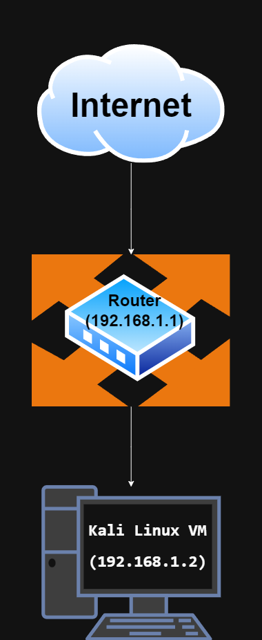

# Networking Task 01 Report

**Date:** June 2026
**Intern:** Prince Raj

---

# Objective

The objective of this task is to understand networking basics, identify network configuration details, perform network connectivity testing, and gain hands-on experience using Linux networking tools.

---

# System Environment

* **Operating System:** Kali Linux VM
* **Virtualization Platform:** VirtualBox
* **Network Interface:** eth0

---

# Part A: Network Information

The following network information was collected from the Kali Linux virtual machine.

| Parameter       | Value             |
| --------------- | ----------------- |
| Hostname        | kali              |
| IPv4 Address    | 192.168.1.2       |
| MAC Address     | 08:00:27:8a:35:d2 |
| Default Gateway | 192.168.1.1       |
| DNS Server      | 192.168.1.1       |

## Commands Used

```bash
hostname
ip addr
ip route
cat /etc/resolv.conf
```

## Network Information Explanation

### Hostname

Hostname identifies a device within a network.

```text
kali
```

### IPv4 Address

```text
192.168.1.2
```

This address uniquely identifies the device inside the local network.

### MAC Address

```text
08:00:27:8a:35:d2
```

This uniquely identifies the physical network interface.

### Default Gateway

```text
192.168.1.1
```

This router forwards traffic outside the local network.

### DNS Server

```text
192.168.1.1
```

Used to resolve domain names into IP addresses.

---

# Part B: Basic Networking Concepts

## What is an IP Address?

An IP address is a numerical identifier assigned to devices connected to a network. It enables communication between devices and identifies sources and destinations of network traffic.

## What is a MAC Address?

A MAC address is a hardware-level identifier permanently assigned to a network interface card. It is mainly used for communication inside local networks.

## What is a Default Gateway?

A default gateway acts as an exit point from a local network and routes packets to external networks such as the internet.

## What is DNS?

DNS (Domain Name System) translates human-readable domain names into machine-readable IP addresses.

Example:

```text
google.com → IP Address
```

## Difference Between Public IP and Private IP

| Public IP           | Private IP                  |
| ------------------- | --------------------------- |
| Used on internet    | Used inside local networks  |
| Assigned by ISP     | Assigned by router          |
| Globally unique     | Can repeat across networks  |
| Accessible publicly | Restricted to local network |

Examples:

Public IP:

```text
49.x.x.x
```

Private IP:

```text
192.168.x.x
```

---

# Part C: Basic Network Diagram

## Diagram



Network structure used during testing:

```text
Internet
   ↓
Home Router (192.168.1.1)
   ↓
VirtualBox Network Adapter
   ↓
Kali Linux VM (192.168.1.2)
```

---

# Part D: Network Connectivity Test

## Commands Executed

```bash
ping -c 4 google.com
traceroute google.com
```

## Ping Results

* 4 packets transmitted
* 4 packets received
* 0% packet loss

Average latency:

```text
84.385 ms
```

Conclusion:

```text
Ping Successful: YES
```

## Traceroute Results

Total hops observed:

```text
10 hops
```

Traceroute displayed multiple intermediate routers between the local network and destination.

## Purpose of Traceroute

Traceroute helps:

* Identify routing paths
* Troubleshoot network problems
* Detect packet delays
* Locate failing network segments

---

# Screenshots Included

```text
screenshots/

├── hostname.png
├── ip_addr_mac.png
├── gateway.png
├── dns.png
├── ping_google.png
├── traceroute.png
├── network_diagram.png
```

---

# Files Included

```text
Networking_Task_01_PrinceRaj/

├── screenshots/
├── command_outputs.txt
├── README.md
```

---

# Conclusion

This task provided practical understanding of network configuration, addressing, routing, DNS resolution, and connectivity testing. Linux networking commands were used to inspect the system and verify internet connectivity successfully.
